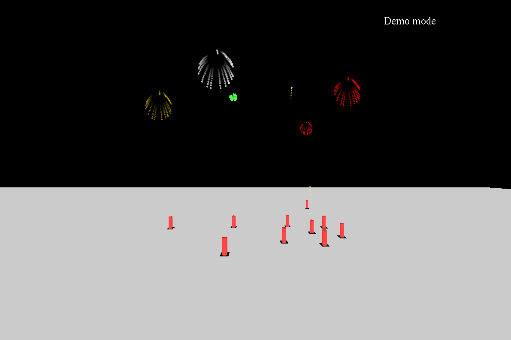

# fireglut

This software displays a simple firework simulation. Place fireworks to create your own firework show.

## Usage

Run the program by executing:

	make
	./fireworks

Requires Opengl and Glut packages to be installed. Openal packages are included in the openal folder and do not have to be installed seperately.

## Controls:

### MOVEMENT

| Key | Function |
|-|-|
| w | Forward |
| a | Left |
| s | Backward |
| d | Right |
| z | Up |
| x | Down |

### FUNCTIONS

| Key | Function |
|-|-|
| f | Fire one firework |
| g | Fire all fireworks at once |
| h | Auto fire |
| p | Place new firework on the ground |
| r | Reset camera |
| m | Mute all sound |
| - | Exit |

### GAME MODES

| Key | Function |
|-|-|
| 1 | Demo mode |
| 2 | Free roam |

### LIGHTING

| Key | Function |
|-|-|
| i | Up |
| j | Left |
| k | Down |
| l | Right |
| u | Toggle ambient |
| o | Toggle diffuse |
| n | Toggle material |
